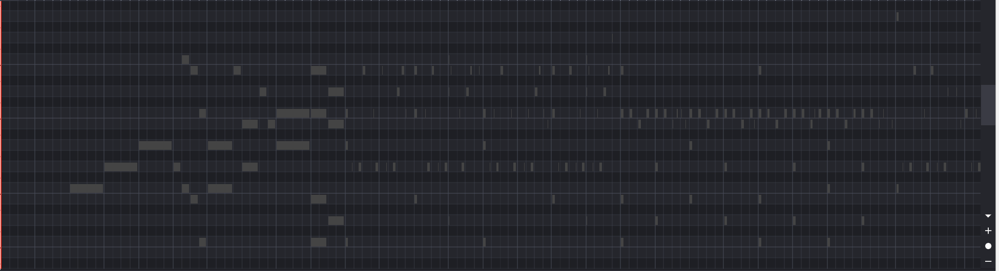
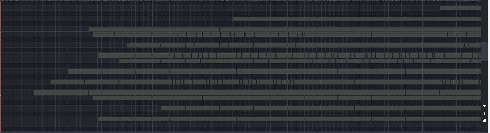

# MIDI Note Extender

MIDI Note Extender is a Python script, used for extending each note's end to the start of the next note.

## Usage

1. Install the required dependency:
   ```
   pip install mido
   ```
2. Run the script:
   ```
   python extend_notes.py input_file.mid output_file.mid
   ```

## Before and After Comparison




## Notes

The BPM of the out MIDI file may change. You may need to adjust it manually.

# MIDI Note Extender

MIDI Note Extender 是一个 Python 脚本,用于将每个音符的结尾延长到下一个音符的开始:

## 使用方法

1. 安装所需的依赖:

   ```
   pip install mido
   ```

2. 运行脚本:

   ```
   python extend_notes.py input_file.mid output_file.mid
   ```

## 使用前后对比


## 注意

在使用脚本处理后输出的 mid 文件的 bpm 可能会发生变化，可能需要手动调整。
